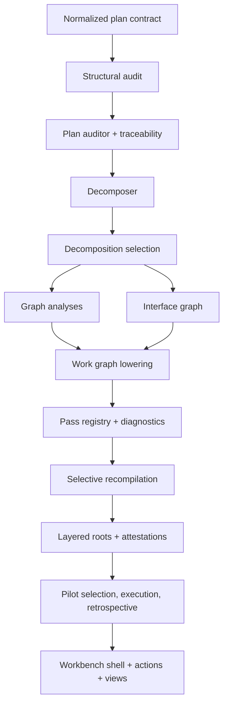

# Planning compiler

The planning compiler in `lib/conveyor/planning/` is a pure-function compiler
pass architecture that lowers human-authored plans into dependency-ordered work
graphs. Every pass takes a structured input and returns a structured output
without side effects, so planning interrogation can run before any persistence
or agent synthesis path. The compiler is the first link in the determinism
boundary: it owns structural audits, decomposition, graph analysis, amendment
enforcement, and selective recompilation, while agents only ever see the lowered
output.

## Compiler pass flow

## Plan auditing

The front-end audit is `lib/conveyor/planning/structural_audit.ex`, a
deterministic pure module that checks normalized planning contracts before any
persistence or agent synthesis. It runs requirement-acceptance linkage (every
requirement has an acceptance criterion, no orphan criteria, no undefined refs),
planning guardrails (non-goals and decisions must be present), acceptance
quality (rejects vague terms like "better", "fast", "robust", requires oracle
paths), contradiction detection (polarized "must"/"must not" statements,
contradictory enums/statuses/interfaces/hard constraints), and source
consistency (source map and claim alignment). Findings are sorted
deterministically and each carries `next_actions` that can drive workbench
repair proposals.

`lib/conveyor/planning/plan_lint.ex` and
`lib/conveyor/planning/plan_lint_cli.ex` wrap the audit for CLI consumption,
while `lib/conveyor/plan_auditor.ex` orchestrates the broader audit including
traceability and threat-matrix checks.

## Work graph lowering

`lib/conveyor/planning/work_graph_lowering.ex` lowers a selected decomposition
candidate to `conveyor.work_graph@2` IR. Lowering is all-or-nothing: an invalid
proposal shape or a stale `PlanningSpec` digest returns diagnostics and no
materialized `WorkGraph`. The lowering validates schema version, planning spec
digest match, frozen spec status, required fields (candidate key, claim set ref,
derivation manifest ref, scope delta), list shapes (epics, slices, atomicity
groups, work deps, interface contracts, interface bindings, decision blocks),
and per-slice fields (stable key, proposal key, title, why this slice).

## Graph analyses

`lib/conveyor/planning/graph_analyses.ex` runs pure graph analyses over compiler
output: atomicity group membership, scope delta against approved globs,
traceability gaps (slices without requirements, acceptance criteria, or
obligations), anti-confetti checks (slices too small, coordination overhead,
false parallelism, excessive risk domains), and oracle feasibility.

`lib/conveyor/planning/interface_graph.ex` analyzes interface contract and
binding readiness separately from slice work dependencies. It resolves
`requires` bindings against declared contracts, checks version satisfaction with
multi-segment comparison, and reports missing-provider and version-incompatible
diagnostics.

## Decomposition

`lib/conveyor/planning/decomposer.ex` is the proposal-boundary decomposer.
Candidates are artifacts only: they carry proposed work structure but never
assign canonical final IDs. For high-risk plans an optional shadow candidate is
generated alongside the primary.

`lib/conveyor/planning/decomposition_selection.ex` performs deterministic
candidate comparison. A candidate is selected only when it strictly dominates on
hard invariants (coverage, independence, atomicity, edge count, interface
complexity, approval load) without unapproved scope. Ties and ambiguous
comparisons require a `HumanDecision`; candidates are never auto-blended.

## Amendments

`lib/conveyor/planning/plan_amendments.ex` projects `PlanAmendmentProposal`
resources from already-resolved derivation, interface, and authority indexes. It
does not mutate plans; it produces the proposal that a human or later policy
step can accept, reject, or apply. It uses `InvalidationPreview` and
`ImpactPreview` to compute affected refs, downstream refs, and invalidated
artifact refs.

`lib/conveyor/planning/amendment_enforcement.ex` enforces contract-evolution
authority rules for material amendments. A material or breaking change
terminates the base attempt and requires a new attempt with a fresh authority
root, contract lock, run spec, and run attempt. Non-material changes keep the
prior attempt. It also produces `ManualInterventionArtifact` records and
verdicts that detect hidden manual reconstruction and manual interventions
mislabeled as generated success.

`lib/conveyor/planning/selective_invalidation.ex` classifies selective
invalidation outcomes for amendment changes, distinguishing shared interface
changes (invalidate downstream attempts), review-only corrections (unchanged and
reusable), and waiver changes (invalidate obligations, requalify scope).

## Workbench

The workbench is a read-only projection surface for plan interrogation and
structured actions:

- `lib/conveyor/planning/workbench_shell.ex` projects the Qualification Cockpit
  and Plan Workbench shell, with static/headless bundle parity checks and panel
  summaries (grants, samples, invariants, adapters, health, replay, obligations,
  budgets, stop state).
- `lib/conveyor/planning/workbench_actions.ex` compiles structured workbench
  actions into append-only `ChangeSet` resources. The action catalog includes
  approve/reject epics, select candidates, accept/reject claims and waivers,
  split, merge, reclassify edges, change constraints/interfaces/compatibility,
  strengthen contracts, rerun affected, preview invalidation, open amendments,
  save drafts, stop, and resume.
- `lib/conveyor/planning/workbench_views.ex` projects core read-only workbench
  views (claims, constraints, candidates, work graph, interfaces, decision
  blocks, obligations, derivations, diffs, approvals) organized into lanes
  (intent, traceability, risk recovery, code impact).

## Pass registry and diagnostics

`lib/conveyor/planning/pass_registry.ex` is a generic deterministic pure-pass
registry with restricted read context. Each pass declares its key, version,
input/output stages, selectors (the only inputs it may read), cache policy, and
authority effect. The registry caches outputs by a content-addressed key derived
from the pass key, version, semantic digest, authority digest, and selectors. A
pass that tries to read an undeclared selector raises immediately.

`lib/conveyor/planning/pass_diagnostics.ex` handles deterministic pass
diagnostics and partial artifact salvage. A failed fragment does not erase
successful sibling fragments. Successful outputs are content-addressed with a
`reuse_key` so later passes can inspect or reuse them under explicit partial
authority. The `authority_effect` distinguishes `complete_reusable` from
`partial_no_execution_authority`.

## Selective recompilation

`lib/conveyor/planning/selective_recompilation.ex` plans affected-pass
recompilation from invalidation inputs. Reuse is conservative: an output is
retained only when every input ref is explicitly proven valid, no input or
output is invalidated, and any attached approval is still valid. When impact
confidence is low (below 0.8), the planner fails wide and reruns all passes
rather than risk silent staleness.

## Layered roots and attestations

`lib/conveyor/planning/layered_roots.ex` builds domain-separated authority,
review, and archive root manifests. It produces a shared authority root,
per-epic authority roots, a review root, and an archive bundle root, each with a
domain-separated SHA-256 digest over RFC 8785 canonical JSON. Approval records
are excluded from the sorted entry set and tracked separately.

`lib/conveyor/planning/root_attestations.ex` emits canonical in-toto statements
over planning roots and supporting evidence. Each statement carries subjects
(roots and evidence), a predicate with root manifest digests, canonicalization
profile, and hash algorithm, plus optional signature status, signer identity,
and verification bundle ref.

## Pilot selection and retrospective

`lib/conveyor/planning/pilot_selection.ex` freezes pre-registered pilot
selection before implementation starts. It blocks if implementation has already
started. For plans with 12 or fewer slices, all machine-executable slices are
selected; larger plans use a coverage sample across required coverage classes
(root slice, terminal slice, dependency pair, fork/join, public interface,
migration compatibility, low/high risk, parked path, human verification,
unchanged contract, amendment path, alternative candidate).

`lib/conveyor/planning/pilot_execution.ex` summarizes serial execution of a
pre-registered pilot selection. It blocks if implementation width is not 1, then
records serial order, first-pass and eventual gate success rates,
clarification/dispute rates, context miss counts, missing obligation/interface
counts, post-start amendment counts, human edit counts, and diagnosis/recovery
quality.

`lib/conveyor/planning/pilot_retrospective.ex` builds the pilot retrospective
and class-separated Chronicle projection. It classifies failures into plan,
compiler, context, implementation, evidence, adapter, and operator classes, and
detects release failures (selected set changed after outcomes, failed selection
replaced, from-scratch manual contract rewrite).

## Materiality policy

`lib/conveyor/planning/materiality_policy.ex` is the deterministic materiality
classifier and micro-negotiation policy. It separates classification from
authority: labels like `acceptance_weakened`, `scope_added`, `policy_weakened`,
and `incomparable` are material; narrow labels like `compatibility_superset`,
`example_added`, and `type_clarification` are nonmaterial. Shadow mode may
record a `would_auto_accept` decision, but only `pre_attempt_auto_accept` mode
can produce an actual auto-accept, and only under the full eligibility checklist
(narrow labels, narrow areas, preserves existing consumers, contract author
verdict accepted, before attempt started, active qualification grant, within
round limit).

## Key source files

| File                                               | Purpose                                                                                 |
| -------------------------------------------------- | --------------------------------------------------------------------------------------- |
| `lib/conveyor/planning/structural_audit.ex`        | Deterministic front-end structural audit of normalized planning contracts.              |
| `lib/conveyor/planning/work_graph_lowering.ex`     | Lowers a selected decomposition candidate to `conveyor.work_graph@2` IR.                |
| `lib/conveyor/planning/graph_analyses.ex`          | Pure graph analyses: atomicity, scope, traceability, anti-confetti, oracle feasibility. |
| `lib/conveyor/planning/interface_graph.ex`         | Interface contract and binding readiness analysis with version satisfaction.            |
| `lib/conveyor/planning/decomposer.ex`              | Proposal-boundary decomposer that generates primary and optional shadow candidates.     |
| `lib/conveyor/planning/decomposition_selection.ex` | Deterministic candidate comparison and strict-domination selection.                     |
| `lib/conveyor/planning/plan_amendments.ex`         | Projects `PlanAmendmentProposal` resources from resolved indexes.                       |
| `lib/conveyor/planning/amendment_enforcement.ex`   | Enforces contract-evolution authority rules for material amendments.                    |
| `lib/conveyor/planning/selective_invalidation.ex`  | Classifies selective invalidation outcomes for amendment changes.                       |
| `lib/conveyor/planning/workbench_shell.ex`         | Read-only Qualification Cockpit and Plan Workbench shell projection.                    |
| `lib/conveyor/planning/workbench_actions.ex`       | Compiles structured workbench actions into append-only ChangeSets.                      |
| `lib/conveyor/planning/workbench_views.ex`         | Core read-only Plan Workbench view projection with lanes.                               |
| `lib/conveyor/planning/pass_registry.ex`           | Generic deterministic pure-pass registry with restricted read context and caching.      |
| `lib/conveyor/planning/pass_diagnostics.ex`        | Deterministic pass diagnostics and partial artifact salvage.                            |
| `lib/conveyor/planning/selective_recompilation.ex` | Plans affected-pass recompilation from invalidation inputs.                             |
| `lib/conveyor/planning/layered_roots.ex`           | Builds domain-separated authority, review, and archive root manifests.                  |
| `lib/conveyor/planning/root_attestations.ex`       | Emits canonical in-toto statements over planning roots and evidence.                    |
| `lib/conveyor/planning/pilot_selection.ex`         | Freezes pre-registered pilot selection before implementation starts.                    |
| `lib/conveyor/planning/pilot_execution.ex`         | Summarizes serial execution of a pre-registered pilot selection.                        |
| `lib/conveyor/planning/pilot_retrospective.ex`     | Builds pilot retrospective and class-separated Chronicle projection.                    |
| `lib/conveyor/planning/materiality_policy.ex`      | Deterministic materiality classifier and micro-negotiation policy.                      |
| `lib/conveyor/plan_auditor.ex`                     | Orchestrates broader plan audit including traceability and threat-matrix checks.        |

## Related pages

- [Architecture](../overview/architecture.md) — system topology and station
  pipeline
- [Contract forge](contract-forge.md) — drafting contracts from plan
  requirements
- [Contract critic](contract-critic.md) — criticizing and repairing contracts
- [Qualification](qualification.md) — qualifying plans and contracts for
  execution
- [Slice](../primitives/slice.md) — slice domain model
