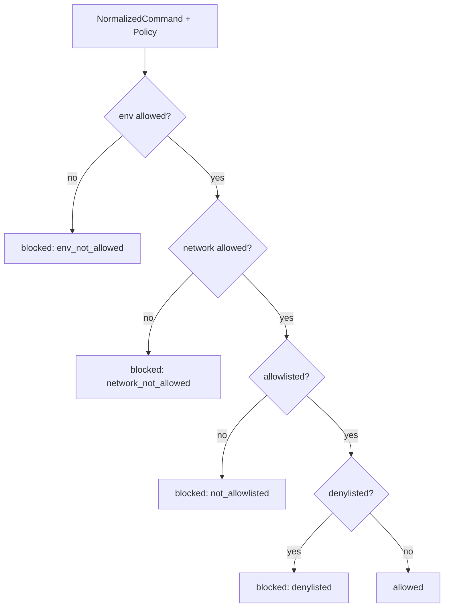

# Policy engine

The policy engine is the command-level safety boundary that decides whether a
normalized command may run inside a sandbox. It evaluates each command against a
named profile's allowlist, denylist, environment allowlist, and network policy,
then returns an explicit `Decision` the caller can record or block on. A second
layer, the run budget guard, caps per-run resource consumption (tool calls,
output bytes, wall clock, cost) and stops the affected run attempt when a cap is
breached. Violations are funneled through a violation handler that creates an
incident, stops the run attempt, transitions the slice, and writes a ledger
event.

## Directory layout

The policy engine lives under `lib/conveyor/policy/`:

```
lib/conveyor/
├── policy/
│   ├── engine.ex              # Decision service: allow/block per profile
│   ├── normalized_command.ex  # Canonical command shape before evaluation
│   ├── profiles.ex            # Loads TOML policy profiles into Policy records
│   ├── run_budget_guard.ex    # Per-run budget caps and exhaustion handling
│   └── violation_handler.ex   # Records incidents and stops work on block
└── factory/
    └── policy.ex              # Ash resource: named profile record
```

## Key abstractions

| Abstraction | Location | Role |
| --- | --- | --- |
| `Conveyor.Policy.Engine` | `lib/conveyor/policy/engine.ex` | Decision service. Evaluates a `NormalizedCommand` against a `Policy` and returns a `Decision`. |
| `Conveyor.Policy.Engine.Decision` | `lib/conveyor/policy/engine.ex` | The verdict: `status` (`:allowed` / `:blocked`), `reason`, message, profile, and command text. |
| `Conveyor.Policy.NormalizedCommand` | `lib/conveyor/policy/normalized_command.ex` | Canonical command shape: executable, argv, cwd, env keys, network mode, read/write roots, timeout. Rejects raw shell strings. |
| `Conveyor.Policy.Profiles` | `lib/conveyor/policy/profiles.ex` | Loads and validates the five required TOML profiles (`explore`, `implement`, `verify`, `release`, `maintenance`) into `Policy` records. |
| `Conveyor.Policy.RunBudgetGuard` | `lib/conveyor/policy/run_budget_guard.ex` | Applies per-run budget caps and stops the run attempt, slice, and ledger on exhaustion. |
| `Conveyor.Policy.RunBudgetGuard.Result` | `lib/conveyor/policy/run_budget_guard.ex` | Outcome of a budget record: `status` (`:active` / `:exhausted`), exceeded cap, finding, run attempt, slice, ledger event. |
| `Conveyor.Policy.ViolationHandler` | `lib/conveyor/policy/violation_handler.ex` | Records a blocked `Decision` as an `Incident`, stops the run attempt, transitions the slice, writes a ledger event. |
| `Conveyor.Policy.ViolationHandler.Result` | `lib/conveyor/policy/violation_handler.ex` | The violation outcome: incident, run attempt, slice, ledger event. |
| `Conveyor.Factory.Policy` | `lib/conveyor/factory/policy.ex` | Ash resource for a named profile: allowlist, denylist, env/network/budget policy, autonomy ceiling. |

## How it works

### Command normalization

Every command path starts with `NormalizedCommand.normalize!/2`. It takes a
`Conveyor.Config.CommandSpec` (never a raw shell string) and a required
`:workspace_root` option, then produces a canonical struct with resolved paths:
the cwd, write roots, and read roots are all expanded and checked to stay under
the workspace root. Terminal symlinks are resolved so a symlinked workspace
cannot escape the boundary. The `network` field is one of `:none`, `:loopback`,
or `:egress`. Raw shell commands (`%{command: ...}`, `%{"command" => ...}`, or
a bare binary) raise `ArgumentError` so no execution path can bypass
normalization.

### Decision evaluation

`Engine.evaluate!/2` runs a fixed-order predicate chain over the normalized
command text (executable joined with argv). The order is intentional: the most
specific guardrails fire first.



Env and network checks run before the allowlist so a command that happens to
match an allowlist entry cannot smuggle a forbidden env key or network mode. The
network ladder is monotonic: `none` permits only `:none`, `loopback` permits
`:none` and `:loopback`, `egress` permits all three. Allowlist and denylist
matching use exact equality or prefix matching (`command == pattern` or
`command starts with pattern <> " "`), so an allowlist entry for `"git"` matches
`"git status"` but not `"gitter"`.

### Profile loading

`Profiles.load_dir/1` reads `*.toml` files from a policy directory, validates
that all five required profiles are present (`explore`, `implement`, `verify`,
`release`, `maintenance`), and upserts each into a `Policy` record. Each profile
declares a `name`, `profile`, `autonomy_ceiling` (L0 through L4), `allowlist`,
`denylist`, `network`, `env`, and `budget`. The `future_gated` flag defaults to
`true` for `release` and `maintenance` profiles and is merged into the budget
policy.

### Run budget guard

`RunBudgetGuard.record!/3` accumulates measurements (tool calls, command count,
output bytes, repeated commands, same-file rewrites, idle time, wall clock,
tokens, cost) against a `RunBudget`. It checks ten caps in a single pass; the
first exceeded cap wins. On exhaustion it updates the budget to `:exhausted`,
fails the run attempt with `failure_category: "budget_exhausted"`, transitions
the slice to `:needs_rework`, and writes a `budget.exhausted` ledger event with
an idempotency key scoped to the budget and cap. All four writes happen in a
single `Repo.transaction`.

### Violation handling

`ViolationHandler.record!/3` is called with a blocked `Decision` and the
`ToolInvocation` that triggered it. It resolves the run attempt, slice, and
project context, then in a single transaction: creates an `Incident`
(`category: "policy_violation"`), stops the run attempt
(`outcome: :policy_blocked`, `failure_category: "policy_violation"`),
transitions the slice (`:failed` for `:critical` severity, `:policy_blocked`
otherwise), and writes a `policy.blocked` ledger event. The idempotency key is
`policy_blocked:<tool_invocation_id>` so the same violation cannot be recorded
twice.

## Integration points

- **ToolExecutor** (`lib/conveyor/tool_executor.ex`) — calls `Engine.evaluate!/2`
  before executing any command. A blocked decision triggers
  `ViolationHandler.record!/3`. See [Sandbox](sandbox.md).
- **PolicyExecutor** (`lib/conveyor/sandbox/policy_executor.ex`) — wraps
  ToolExecutor with a Docker runner so policy-checked commands execute inside a
  materialized sandbox container.
- **NormalizedCommand** — consumed by both the policy engine and the sandbox
  runner. The sandbox runner reads `network`, `write_roots`, `read_roots`, and
  `timeout_ms` to enforce the filesystem and network boundary at execution time.
- **RunBudget** resource (`lib/conveyor/factory/run_budget.ex`) — the persisted
  budget counters and caps that `RunBudgetGuard` reads and updates.
- **AgentRunner.Pi** (`lib/conveyor/agent_runner/pi.ex`) — passes the policy
  snapshot to the Pi RPC client and records budget exhaustion via
  `RunBudgetGuard.record!/3` when `SessionLimits` halts a session. See
  [Agent runner](agent-runner.md).
- **Incident** resource (`lib/conveyor/factory/incident.ex`) — the persisted
  policy violation record created by `ViolationHandler`.
- **Ledger** (`lib/conveyor/ledger.ex`) — both the budget guard and violation
  handler write idempotent ledger events so policy and budget events are part of
  the durable run story.

## Entry points for modification

- **Add a new decision reason** — extend the `reason` type in
  `Engine.Decision` and add a predicate to the `cond` chain in
  `Engine.evaluate!/2`. Order matters: earlier predicates take precedence.
- **Change allowlist/denylist matching** — `command_matches?/2` in
  `lib/conveyor/policy/engine.ex` is the single matcher. It currently does exact
  and prefix matching; glob or regex support would live here.
- **Add or change a budget cap** — `exceeded_cap/3` in
  `lib/conveyor/run_budget_guard.ex` lists the ten caps. Add a new tuple to the
  list and a corresponding field on `RunBudget`. The `finding/3` builder will
  carry the new cap name into the ledger event.
- **Change violation severity handling** — `transition_slice/2` in
  `lib/conveyor/policy/violation_handler.ex` is where `:critical` severity fails
  the slice outright versus `:policy_blocked` for other severities.
- **Add a new profile** — add the profile atom to `@required_profiles` in
  `lib/conveyor/policy/profiles.ex` and create the corresponding TOML file in
  the policy directory. The `Factory.Policy` resource constraint also needs the
  new atom.
- **Change network policy semantics** — `network_allowed?/2` in
  `lib/conveyor/policy/engine.ex` and `NetworkPolicy.docker_args/1` in
  `lib/conveyor/sandbox/network_policy.ex` must stay aligned so the decision and
  the Docker enforcement agree.

## Key source files

| File | Role |
| --- | --- |
| `lib/conveyor/policy/engine.ex` | Decision service; `Decision` struct; evaluation chain. |
| `lib/conveyor/policy/normalized_command.ex` | Canonical command normalization and workspace path validation. |
| `lib/conveyor/policy/profiles.ex` | TOML profile loading, validation, and upsert into `Policy` records. |
| `lib/conveyor/policy/run_budget_guard.ex` | Per-run budget accumulation, cap checking, and exhaustion handling. |
| `lib/conveyor/policy/violation_handler.ex` | Incident creation, run/slice stop, and ledger event on policy block. |
| `lib/conveyor/factory/policy.ex` | Ash resource for the named policy profile. |
| `lib/conveyor/factory/incident.ex` | Ash resource for persisted policy violation incidents. |
| `lib/conveyor/factory/run_budget.ex` | Ash resource for persisted run budget counters and caps. |

See also: [Sandbox](sandbox.md), [Agent runner](agent-runner.md),
[Trust gate](gate.md), [Station pipeline](../features/station-pipeline.md).
