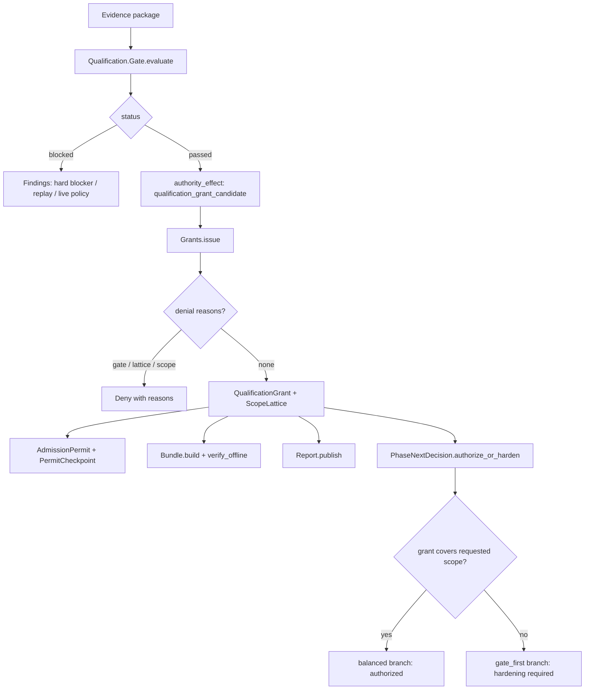

# Qualification system

The qualification system manages scoped qualification grants that record what
Conveyor has proven it can do, and impact expiry that invalidates those grants
when the underlying evidence or policy changes. A grant is immutable evidence
about a supported scope (adapter, archetype, change class, toolchain, risk
class); an admission permit is a derived current-authority projection for one
effectful run boundary. The gate, bundle, and report modules keep the
authority-critical facts structured so a prose summary cannot hide blockers,
limitations, waivers, or residual risk.

## Directory layout

All qualification modules live under `lib/conveyor/qualification/`:

```text
lib/conveyor/qualification/
├── gate.ex                  # pure P15-B8 qualification gate evaluator
├── grants.ex                # grant, scope lattice, admission permit, checkpoint issuance
├── bundle.ex                # offline-verifiable qualification bundle projection
├── phase_next_decision.ex   # updates PhaseNextDecision after qualification review
└── report.ex                # canonical release-facing grant report projection
```

## Key abstractions

| Abstraction | Location | Role |
| --- | --- | --- |
| `Conveyor.Qualification.Gate` | `lib/conveyor/qualification/gate.ex` | Pure gate evaluator. Checks hard blockers, replay modes, and live sample policy. Returns `:passed` or `:blocked` with findings; never issues authority by itself. |
| `Conveyor.Qualification.Grants` | `lib/conveyor/qualification/grants.ex` | Pure grant issuance. `issue/1` builds a `QualificationGrant`, `QualificationScopeLattice`, `AdmissionPermit`, and `PermitCheckpoint` when the gate passed, the lattice passed, and the scope is covered. |
| `QualificationGrant` | `lib/conveyor/qualification/grants.ex` | The `conveyor.qualification_grant@1` artifact: immutable evidence about a supported scope, with invalidation triggers, success-rate bands, limitations, and waivers. |
| `QualificationScopeLattice` | `lib/conveyor/qualification/grants.ex` | The `conveyor.qualification_scope_lattice@1` artifact: direct, inherited, supporting, and unassessed evidence strata for a scope, with inheritance rules. |
| `AdmissionPermit` | `lib/conveyor/qualification/grants.ex` | The `conveyor.admission_permit@1` artifact: derived current-authority projection for one effectful run boundary. Ties a subject to a grant, policy, environment, and capability set digest. |
| `PermitCheckpoint` | `lib/conveyor/qualification/grants.ex` | The `conveyor.permit_checkpoint@1` artifact: validates that inputs match the permit's spec digest before an effectful boundary. |
| `Conveyor.Qualification.Bundle` | `lib/conveyor/qualification/bundle.ex` | Builds the `conveyor.qualification_bundle@1` offline-verifiable projection and verifies it without consulting the live database. |
| `Conveyor.Qualification.PhaseNextDecision` | `lib/conveyor/qualification/phase_next_decision.ex` | Updates the `conveyor.phase_next_decision@1` after P15-B8 review: authorizes the requested P2 scope if the grant covers it, or opens a hardening branch. |
| `Conveyor.Qualification.Report` | `lib/conveyor/qualification/report.ex` | Canonical `conveyor.qualification_release_report@1` projection: grant scope, evidence root, quality intervals, limitations, waivers, expiry, residual risks. |

## How it works

Qualification is a staged pipeline. The gate evaluates an evidence package and
decides whether it is eligible to become a grant candidate. If the gate passes,
the grants module issues the grant, scope lattice, permit, and checkpoint. The
bundle projection packages the grant facts for offline verification, and the
report projection renders them for release. The phase-next-decision module
closes the loop by authorizing or hardening the next phase based on the issued
grant.



### The qualification gate

`Qualification.Gate.evaluate/1` is pure: it takes a plain evidence package and
returns a structured result. It checks three families of hard blockers:

1. **Hard blockers** (`@required_hard_blockers`) — 16 required deterministic
   checks: registry, canonicalization, attestations, derivation, policy, scope,
   deterministic conformance, safety trace assertions, canaries, meta-canaries,
   poison pill, fencing, role view, hidden oracle, test integrity. Any that did
   not pass produces a `qualification_gate_hard_blocker_failed` finding.
2. **Replay modes** (`@required_replay_modes`) — `strict`, `full`, and `hybrid`
   replay must all pass. A missing or non-passing mode produces a
   `qualification_gate_replay_failed` finding.
3. **Live sample policy** — the worst required stratum result must be
   `quality_floor_met` or `miss_observed`. Anything else produces a
   `qualification_gate_live_policy_failed` finding.

The gate sets `authority_effect` to `:qualification_grant_candidate` only when
all findings are empty. It never issues authority directly.

### Grant issuance

`Grants.issue/1` checks three denial conditions before issuing: the gate must
have passed, the scope lattice's `worst_required_stratum_result` must be
`"pass"`, and the supported scope must cover the requested scope (a `*`
wildcard covers any value for a key). When all pass, it builds:

- **QualificationGrant** — keyed by `project_id`, scope digest, adapter class,
  agent class, archetype class, change class, toolchain class, risk class, and
  max autonomy. Carries `invalidation_triggers` (default:
  `policy_digest_changed`, `scope_digest_changed`), success-rate bands,
  limitations, waiver refs, and an optional `expires_at`.
- **QualificationScopeLattice** — direct, inherited, supporting, and unassessed
  evidence strata, with inheritance rule refs and a default inheritance of
  `none`.
- **AdmissionPermit** — ties a subject to the grant, with effective capability
  set digest, authority root digests, policy and environment digests, budget
  reservations, and a control generation counter.
- **PermitCheckpoint** — validates inputs before an effectful boundary, with a
  checkpoint kind (default `before_effectful_boundary`), validated inputs
  digest, and trace id.

### Offline verification

`Bundle.verify_offline/1` is intentionally pure: it only checks fields carried
in the bundle and never consults the live database. It verifies that the scope
digest matches the scope lattice digest, that all required digests
(registry, evidence root, root manifest, run) are present and well-formed
(`sha256:` with 64 hex chars), that all hard invariant verdicts passed, that
canary refs and replay anchors are non-empty, that waivers are available, and
that a signature status is present. The result is a
`conveyor.qualification_bundle_verification@1` with
`checked_without_live_db?: true`.

### Phase-next decision

`PhaseNextDecision.authorize_or_harden/1` compares the requested P2 scope
against the issued grant's scope. If the grant covers the request, it selects a
`balanced` branch with `authorization_result: "authorized"`. If not, it selects
a `gate_first` branch with `authorization_result: "hardening_required"`, blocks
the requested grant, and records a hardening branch. The decision is
content-addressed with a `decision_digest`.

### Release report

`Report.publish/1` builds the canonical release-facing projection from one or
more grant artifacts. Each grant report carries the grant id, scope ref,
deterministic evidence root, live quality intervals (capability, lower/upper
bounds, sample count, policy ref), limitations, unassessed capabilities, active
waivers (id, owner, compensating controls, max autonomy, expiry), issued and
expiry timestamps, invalidation triggers, max autonomy, and residual risks.

## Integration points

- **Trust gate** — the qualification gate's live sample policy result feeds into
  the [Trust gate](gate.md) live-sample component. The gate's required replay
  modes (`strict`, `full`, `hybrid`) are backed by the
  [Cassettes system](cassettes.md) replay engine.
- **Cassettes** — replay anchors from
  `lib/conveyor/cassettes/replay_anchor_set.ex` are carried into the
  qualification bundle (`replay_anchors`) and verified offline.
- **Battery** — the live sample run (`worst_required_stratum_result`,
  `stratum_results`) is produced by the [Battery system](battery.md) live
  sampling module. The gate reads it as the live-policy finding source.
- **Contract forge** — the qualification scope lattice's evidence strata are
  populated from contract-derived verification obligations produced by the
  [Contract forge](contract-forge.md).
- **Contract critic** — the independence profile from the
  [Contract critic](contract-critic.md) gates high-risk change classes, which
  in turn affects the grant's `risk_class` and `max_autonomy`.

## Entry points for modification

- **Add a hard blocker** — add the key to `@required_hard_blockers` in
  `lib/conveyor/qualification/gate.ex`. The gate automatically checks that the
  evidence package's `deterministic_checks` list contains a passing entry for
  it.
- **Add a replay mode requirement** — add the mode to
  `@required_replay_modes` in `lib/conveyor/qualification/gate.ex`.
- **Change grant fields or defaults** — `build_grant/5` in
  `lib/conveyor/qualification/grants.ex` assembles the grant map. Default
  invalidation triggers are `@default_invalidation_triggers`.
- **Change denial conditions** — `denial_reasons/1` in
  `lib/conveyor/qualification/grants.ex` is the single place that checks gate,
  lattice, and scope coverage.
- **Change offline verification checks** — `verify_offline/1` in
  `lib/conveyor/qualification/bundle.ex`.
- **Change the phase-next authorization logic** —
  `authorize_or_harden/1` in `lib/conveyor/qualification/phase_next_decision.ex`.
- **Change the release report shape** — `grant_report/1` in
  `lib/conveyor/qualification/report.ex`.

## Key source files

| File | Role |
| --- | --- |
| `lib/conveyor/qualification/gate.ex` | Pure qualification gate: hard blockers, replay modes, live sample policy. |
| `lib/conveyor/qualification/grants.ex` | Grant, scope lattice, admission permit, checkpoint issuance. |
| `lib/conveyor/qualification/bundle.ex` | Offline-verifiable qualification bundle projection and verifier. |
| `lib/conveyor/qualification/phase_next_decision.ex` | P2 scope authorization or hardening branch. |
| `lib/conveyor/qualification/report.ex` | Canonical release-facing grant report projection. |

See also: [Trust gate](gate.md), [Cassettes system](cassettes.md),
[Battery system](battery.md), [Contract forge](contract-forge.md),
[Contract critic](contract-critic.md), [Planning compiler](planning-compiler.md).
