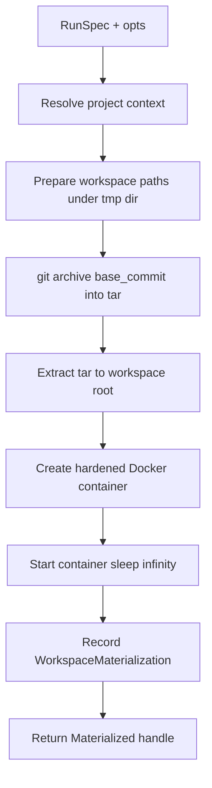

# Sandbox

The sandbox provides Docker-based isolation for agent and verification command
execution. It materializes a clean workspace from a run spec's base commit,
creates a hardened container with a read-only root filesystem and dropped
capabilities, runs policy-checked commands inside it, and cleans up the
container and workspace according to a per-materialization policy. The runner
behaviour abstracts the execution backend so the Docker path and a minimal host
path share one contract. Network policy helpers translate the policy engine's
network modes into Docker arguments and validate egress allowlists against
internal hosts.

## Directory layout

The sandbox lives under `lib/conveyor/sandbox/`:

```
lib/conveyor/
└── sandbox/
    ├── runner.ex              # Runner behaviour and minimal host command runner
    ├── docker_runner.ex       # Docker-backed sandbox runner
    ├── docker_profile.ex      # Hardened Docker create args
    ├── materialized.ex        # Runtime handle for a materialized workspace
    ├── network_policy.ex      # Network mode to Docker args and egress validation
    ├── policy_executor.ex     # Policy-checked command execution inside a sandbox
    ├── reaper.ex              # Orphan workspace reaping service
    └── workspace_cleanup.ex   # Cleanup policy enforcement and tree hashing
```

## Key abstractions

| Abstraction | Location | Role |
| --- | --- | --- |
| `Conveyor.Sandbox.Runner` | `lib/conveyor/sandbox/runner.ex` | Behaviour: `materialize/2`, `exec/2`, `destroy/2`. Includes a minimal host runner that executes a normalized command directly on the host. |
| `Conveyor.Sandbox.Runner.Result` | `lib/conveyor/sandbox/runner.ex` | Command execution outcome: exit code, stdout, stderr, duration. |
| `Conveyor.Sandbox.DockerRunner` | `lib/conveyor/sandbox/docker_runner.ex` | Docker-backed runner. Materializes a workspace via `git archive`, creates a hardened container, execs commands via `docker exec`, and destroys via cleanup. |
| `Conveyor.Sandbox.DockerProfile` | `lib/conveyor/sandbox/docker_profile.ex` | Builds the `docker create` argument list: non-root user, network isolation, no-new-privileges, cap-drop ALL, read-only root, tmpfs, pids/cpu/memory limits. |
| `Conveyor.Sandbox.Materialized` | `lib/conveyor/sandbox/materialized.ex` | Runtime handle: workspace record, project path, root path, container id, image ref. |
| `Conveyor.Sandbox.NetworkPolicy` | `lib/conveyor/sandbox/network_policy.ex` | Maps network modes to Docker args, validates egress allowlists, blocks internal/private hosts. |
| `Conveyor.Sandbox.PolicyExecutor` | `lib/conveyor/sandbox/policy_executor.ex` | Wraps `ToolExecutor` with a Docker runner so policy-checked commands execute inside a materialized sandbox. |
| `Conveyor.Sandbox.Reaper` | `lib/conveyor/sandbox/reaper.ex` | Sweeps pending `WorkspaceMaterialization` records and cleans them up. |
| `Conveyor.Sandbox.Reaper.Result` | `lib/conveyor/sandbox/reaper.ex` | Reap summary: deleted, preserved, failed counts. |
| `Conveyor.Sandbox.WorkspaceCleanup` | `lib/conveyor/sandbox/workspace_cleanup.ex` | Enforces cleanup policies (`delete`, `preserve_always`, `preserve_on_failure`), removes containers, deletes workspace paths, and computes tree SHA256. |
| `Conveyor.Factory.WorkspaceMaterialization` | `lib/conveyor/factory/workspace_materialization.ex` | Ash resource: persisted record of a materialized workspace (path, container id, base commit, head tree, cleanup policy/status). |

## How it works

### Materialization

`DockerRunner.materialize/2` takes a `RunSpec` and opts, then:



The workspace is checked out from the project's git repository at the run spec's
`base_commit` using `git archive`, so the agent starts from a clean, committed
base. If the project lives in a subdirectory of a monorepo, the archive is
scoped to that prefix. The project path is bind-mounted into the container at
`/workspace` with read-write access. If a `.conveyor` directory exists in the
project, it is mounted read-only at `/workspace/.conveyor` so the agent can read
contracts and policy but cannot modify them.

### Container hardening

`DockerProfile.create_args/1` builds the `docker create` arguments that enforce
the sandbox boundary:

- `--user 65532:65532` (non-root, non-mapped UID)
- `--network none` (or egress proxy, per network policy)
- `--security-opt no-new-privileges:true`
- `--cap-drop ALL`
- `--read-only` (root filesystem is read-only)
- `--tmpfs /tmp:rw,noexec,nosuid,size=64m` (writable temp without exec)
- `--pids-limit 256`, `--cpus 1.0`, `--memory 512m`

The container runs `sleep infinity` so it stays alive for the duration of the
run. Commands are executed via `docker exec` with the working directory set to
the container-relative cwd and env keys passed through `--env` flags.

### Command execution

`DockerRunner.exec/3` runs a `NormalizedCommand` inside the container. It maps
the command's host cwd to the container path under `/workspace`, passes
allowlisted env keys, and invokes `docker exec -w <cwd> <env> <container>
<executable> <argv>`. The result is a `Runner.Result` with exit code, combined
stdout, and duration. The command has already been normalized and policy-checked
before it reaches the runner; the runner does not make policy decisions.

`PolicyExecutor.execute!/4` is the composition layer: it takes a `Materialized`
handle, a `NormalizedCommand`, a `Policy`, and opts, then delegates to
`ToolExecutor.execute!/3` with a runner closure that calls `DockerRunner.exec`.
This keeps the policy boundary in `ToolExecutor` and the execution boundary in
the sandbox runner separate.

### Network policy

`NetworkPolicy` translates the policy engine's network modes into Docker
arguments. `:none` produces `--network none`. `:egress` raises because it
requires an explicit external proxy network (no implicit egress is allowed).
Station defaults are all `:none` (`scout`, `implement`, `verify`, `gate`,
`canary`). The `internal_host?/1` check blocks the conductor, database, and all
private IP ranges (127.x, 10.x, 172.16-31.x, 192.168.x) from egress allowlists,
so an agent cannot reach internal infrastructure even if egress is enabled.

### Cleanup and reaping

`WorkspaceCleanup.cleanup/2` enforces the per-materialization cleanup policy:

- `:delete` — removes the container (`docker rm -f`) and deletes the workspace
  path.
- `:preserve_always` — removes the container but keeps the workspace path.
- `:preserve_on_failure` — removes the container; keeps the workspace path only
  if `failed?: true` was passed in opts.

The cleanup status (`:deleted`, `:preserved`, `:failed`) is persisted on the
`WorkspaceMaterialization` record. `tree_sha256/1` walks the workspace file
tree and computes a content-addressed digest over relative paths and file
hashes, used to record the head tree state.

`Reaper.reap!/1` sweeps all `WorkspaceMaterialization` records with
`cleanup_status: :pending` and cleans them up, returning a `Result` with
deleted, preserved, and failed counts. It is a `Conductor.Child` process so it
participates in the supervision tree.

## Integration points

- **Policy engine** — `PolicyExecutor` delegates to `ToolExecutor`, which calls
  `Engine.evaluate!/2` before running any command. A blocked decision triggers
  `ViolationHandler.record!/3`. See [Policy engine](policy-engine.md).
- **NormalizedCommand** — the sandbox runner consumes the same
  `NormalizedCommand` struct the policy engine produces. The `network`,
  `write_roots`, `read_roots`, `cwd`, and `env_keys` fields drive the
  container configuration. See [Policy engine](policy-engine.md).
- **Agent runner** — the agent runs inside a materialized sandbox workspace. The
  workspace path and base commit in `RawRunResult` and `PatchSet` come from the
  `Materialized` handle. See [Agent runner](agent-runner.md).
- **Evidence recording** — `PatchSetApplicator` materializes a clean gate
  workspace using the same `git archive` pattern as `DockerRunner`, but without
  a container, so the gate can replay a patch independently. See
  [Evidence recording](evidence-recording.md).
- **WorkspaceMaterialization resource** (`lib/conveyor/factory/workspace_materialization.ex`)
  — the persisted record that `DockerRunner` creates, `WorkspaceCleanup`
  updates, and `Reaper` sweeps.
- **RunSpec resource** (`lib/conveyor/factory/run_spec.ex`) — the source of the
  base commit, container image ref, and slice context that `DockerRunner` uses
  to materialize a workspace.

## Entry points for modification

- **Add a new runner backend** — implement the `Conveyor.Sandbox.Runner`
  behaviour (`materialize/2`, `exec/2`, `destroy/2`) in a new module. The
  `PolicyExecutor` accepts any runner through its closure, and `DockerRunner`
  is only coupled through `WorkspaceCleanup`.
- **Change container hardening** — `create_args/1` in
  `lib/conveyor/sandbox/docker_profile.ex` is the single source of `docker
  create` flags. `required_security_options/0` lists the security features the
  container must have.
- **Change network defaults** — `@station_defaults` in
  `lib/conveyor/sandbox/network_policy.ex` maps station names to default
  network modes. `docker_args/1` translates modes to Docker flags. The
  `:egress` path must be wired to an explicit proxy network before it can be
  used.
- **Change cleanup policies** — `preserve?/2` and `cleanup/2` in
  `lib/conveyor/sandbox/workspace_cleanup.ex` are the policy enforcement
  points. Add a new policy atom to the `cleanup_policy` field on
  `WorkspaceMaterialization` and a clause to `preserve?/2`.
- **Change reaping behavior** — `reap!/1` in
  `lib/conveyor/sandbox/reaper.ex` filters on `cleanup_status: :pending`. The
  `failed?: true` opt is passed through to `WorkspaceCleanup` so
  `preserve_on_failure` workspaces are preserved during reaping.
- **Change workspace checkout** — `archive_checkout/4` in
  `lib/conveyor/sandbox/docker_runner.ex` handles the `git archive` and tar
  extraction. Monorepo prefix handling is in `archive_pathspec/1`.

## Key source files

| File | Role |
| --- | --- |
| `lib/conveyor/sandbox/runner.ex` | Runner behaviour and host command runner. |
| `lib/conveyor/sandbox/docker_runner.ex` | Docker-backed materialize, exec, destroy. |
| `lib/conveyor/sandbox/docker_profile.ex` | Hardened `docker create` argument builder. |
| `lib/conveyor/sandbox/materialized.ex` | Runtime workspace handle. |
| `lib/conveyor/sandbox/network_policy.ex` | Network mode to Docker args, egress validation. |
| `lib/conveyor/sandbox/policy_executor.ex` | Policy-checked execution inside a sandbox. |
| `lib/conveyor/sandbox/reaper.ex` | Orphan workspace reaping service. |
| `lib/conveyor/sandbox/workspace_cleanup.ex` | Cleanup policy enforcement and tree hashing. |

See also: [Policy engine](policy-engine.md), [Agent runner](agent-runner.md),
[Evidence recording](evidence-recording.md), [Trust gate](gate.md),
[Station pipeline](../features/station-pipeline.md).
